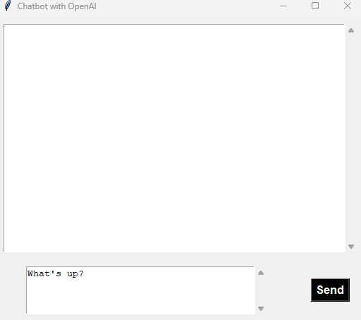

# Chatbot with OpenAI

This is a simple chatbot application built with Tkinter and the OpenAI API.

## Screenshot

## Prerequisites

Before running the application, make sure you have the following:

- Python installed on your machine.
- An OpenAI API key. You can obtain one from [OpenAI's platform](https://platform.openai.com/account/api-keys).

## Installation

1. Clone the repository:
2. Install the required Python packages
3. Set your OpenAI API key:

    Replace "YOUR_API_KEY" in the ChatbotOpenAI.py file with your actual OpenAI API key from:
    https://platform.openai.com/account/api-keys

## Usage
Run the application using the following command:
```
python CHatbotOpenAI.py
```
The GUI window will appear, allowing you to interact with the chatbot.

## Features
Enter your message in the input box.
Click the "Send" button to get responses from the OpenAI language model.
The chat log displays the conversation between you and the chatbot.
Customization
Feel free to customize the code to suit your needs. You can adjust the appearance, modify the OpenAI API call parameters, or add additional features.

## Customization
Feel free to customize the code to suit your needs. You can adjust the appearance, modify the OpenAI API call parameters, or add additional features.

## License
This project is licensed under the License.


